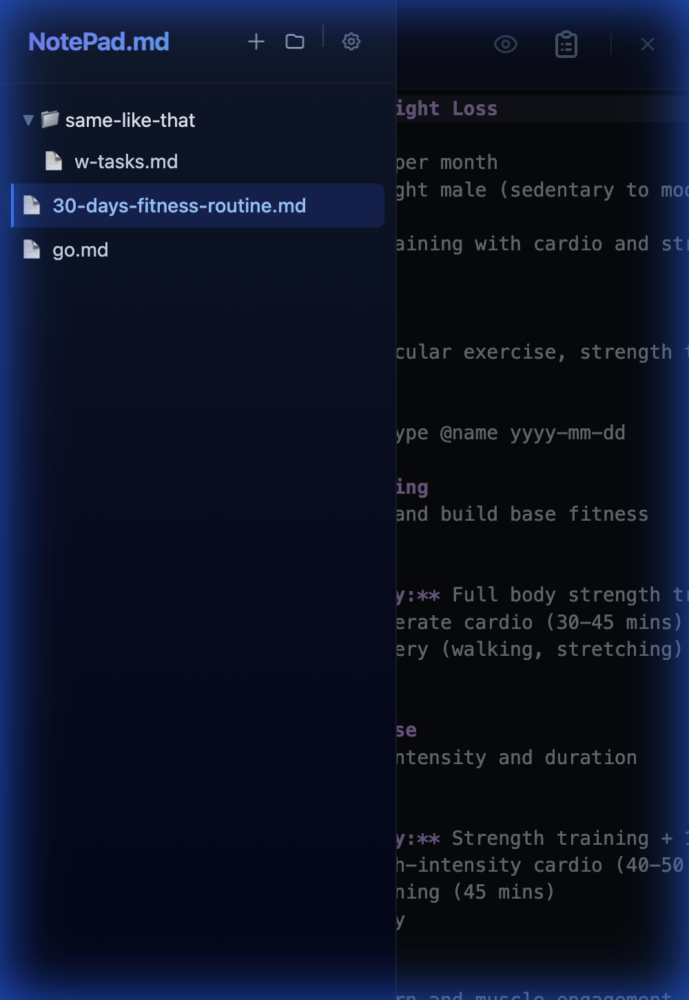
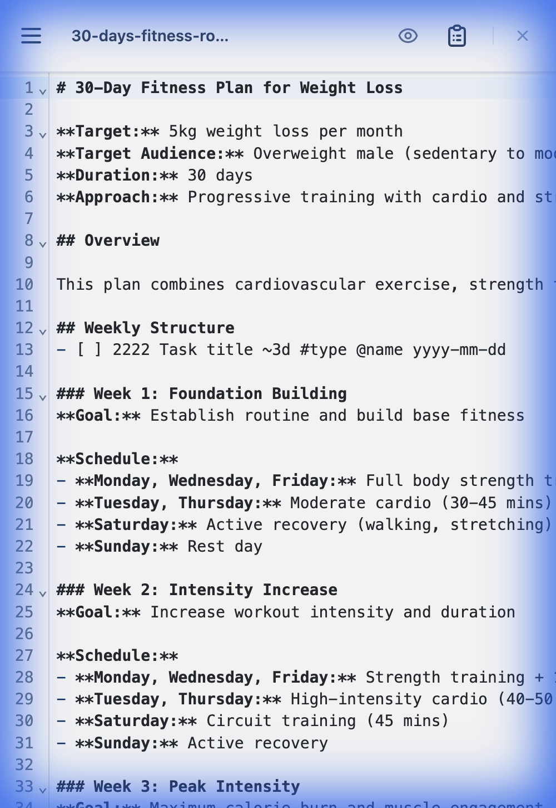
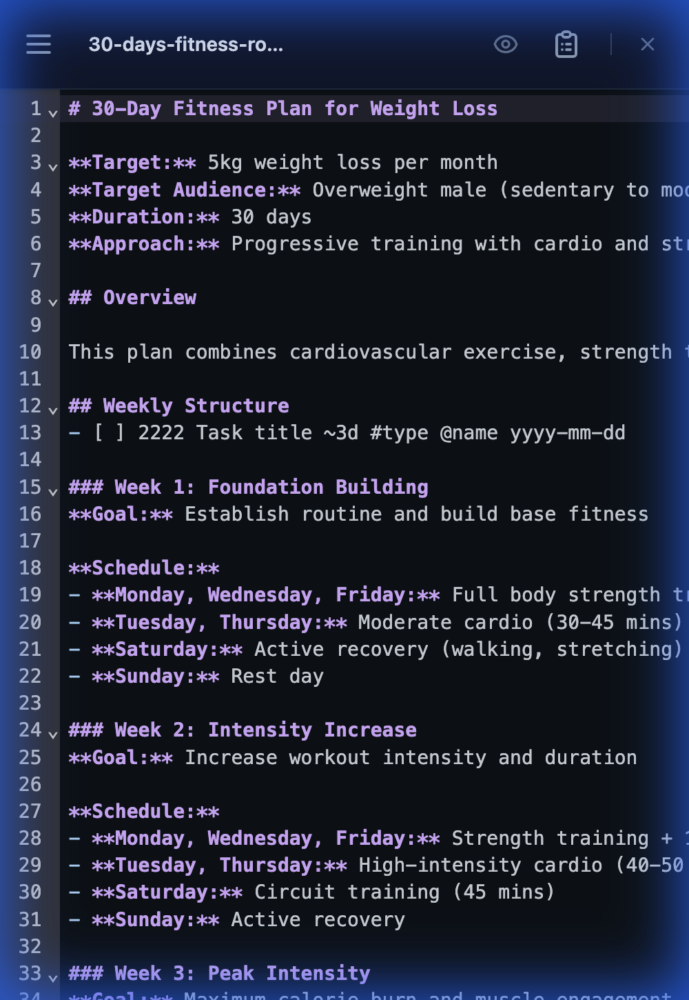

<p align="center">
  
</p>

# NotePad.md

A privacy-focused, client-side markdown note manager built with React. Edit and organize your local markdown files directly in the browser with a clean interface, or use it as a secure in-browser scratchpad.

## Key Features

- **🛡️ 100% Client-Side**: No backend server, no cloud sync, no data leaves your device.
- **📂 Two Storage Modes**:
    1.  **Browser Native (File System Access API)**: Directly edit `.md` files on your local hard drive (Chrome/Edge/Opera).
    2.  **In-Browser Storage (IndexedDB)**: Detailed sandbox environment for any browser (Firefox/Safari/Mobile), persisting data within the browser.
- **📝 Seamless Editing**: Split-view interface with a CodeMirror editor and live Markdown preview.
- **✅ Todo Sync**: Automatically extracts `- [ ]` tasks from your markdown into a dedicated interactive checklist.
- **📦 Data Portability**: Export your entire workspace to a JSON backup and import it back with version validation.
- **⚡ Smart Actions**: Context-aware UI with specialized Primary, Secondary, and Danger buttons for clear user guidance.
- **🎨 Modern UI**: Clean aesthetic with **Dark/Light mode** support.
- **📱 Responsive**: Fully functional on mobile devices with touch-friendly sidebar and controls.

## Screenshots

| **Light Mode** | **Dark Mode** |
|:---:|:---:|
|  |  |

| **Mobile Light** | **Mobile Dark** |
|:---:|:---:|
|  |  |

## Getting Started

### Prerequisites
- Node.js (v18 or higher recommended)

### Installation

```bash
git clone https://github.com/yourusername/notepad-md-app.git
cd notepad-md-app
npm install
```

### Running Locally

```bash
npm run dev
```
Open **http://localhost:5173** in your browser.

## Architecture

This project is a **Single Page Application (SPA)** built with Vite and React. It uses a "Ports and Adapters" pattern to handle file storage, allowing it to switch seamlessly between a real file system and browser storage.

### Tech Stack
- **Frontend**: React 19, TypeScript, Vite
- **Styling**: Tailwind CSS v4
- **Editor**: `@uiw/react-codemirror`
- **Storage**: `Window.showDirectoryPicker` (Native) / `idb-keyval` (IndexedDB) & JSON Backup

### Project Structure
```
src/
├── api/
│   ├── browserAdapter.ts      # File System Access API implementation
│   ├── localStorageAdapter.ts # IndexedDB implementation
│   └── client.ts             # Interface switcher
├── components/
│   ├── ui/                   # Specialized UI (PrimaryButton, DangerButton, Modal, etc.)
│   ├── settings/             # Settings sections (FileSystem, DataManagement, DangerZone)
│   ├── Sidebar.tsx           # File explorer
│   ├── MainPanel.tsx         # Editor & Preview
│   └── TodoPanel.tsx         # Extracted task list
├── config/
│   └── supportedVersions.ts  # Version compatibility config
├── contexts/
│   └── SettingsContext.tsx   # Theme & Storage mode state
└── hooks/                    # Logic for file tree, content, shortcuts, and data import/export
```

## Browser Support

| Feature | Chrome / Edge | Firefox | Safari | Mobile |
| :--- | :---: | :---: | :---: | :---: |
| **In-Browser Storage** | ✅ | ✅ | ✅ | ✅ |
| **Local File Access** | ✅ | ❌ | ❌ | ❌ |

*Note: For browsers without File System Access API support (Firefox, Safari), the app automatically defaults to In-Browser Storage.*
